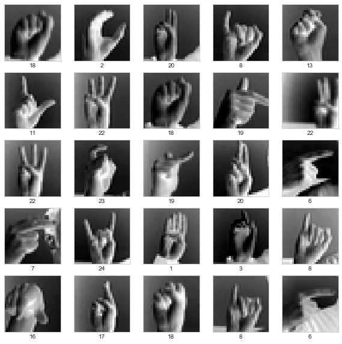

### Sing Language Recognition 

This **[Notebook][Multi-Class-Sing.ipynb]** aims at introducing ImageDataGenerator, and show how it can be used to train a model to recongise sign language in a set of images. You will need to download the dataset from Kaggle https://www.kaggle.com/datamunge/sign-language-mnist and save it in your local drive. The use of `ImageDataGenerator` enable us to do data augmentation which is an essential task in many machine learnign algorithms. For more details see keras docs https://keras.io/preprocessing/image/. 

