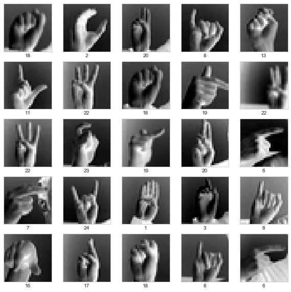
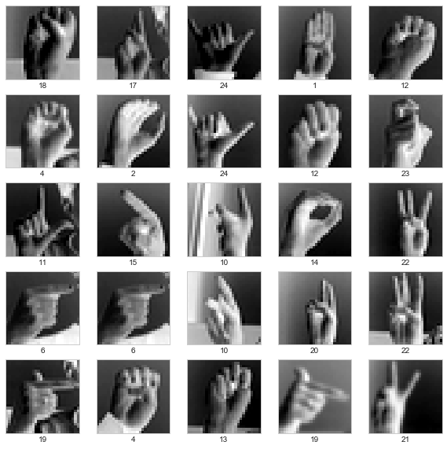
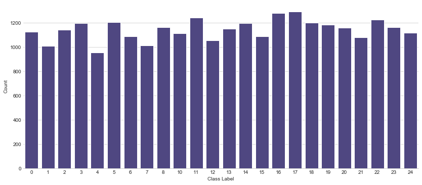
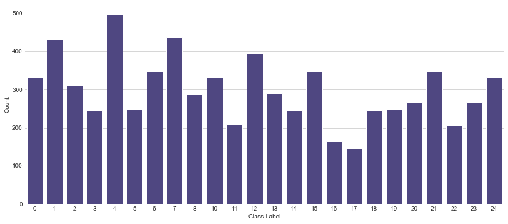
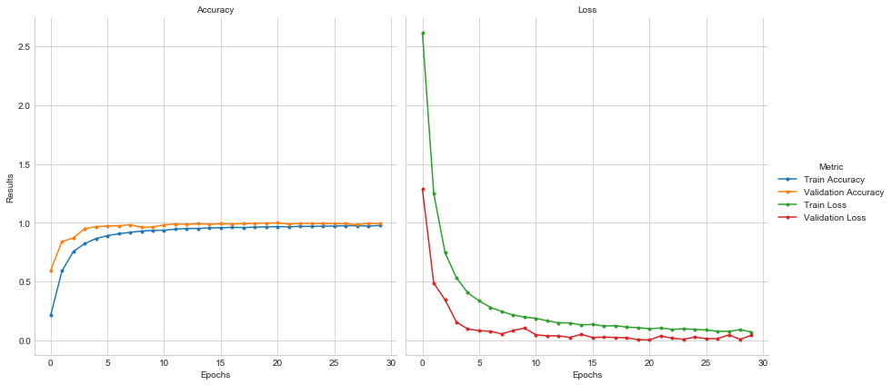
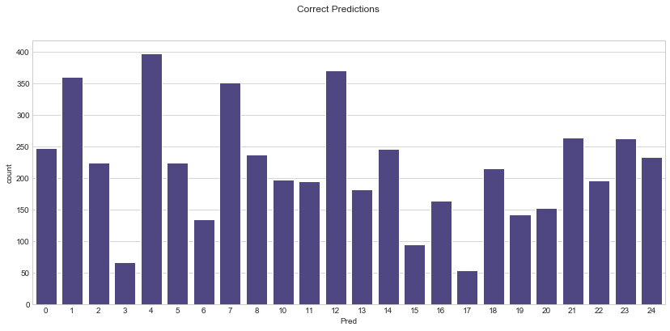
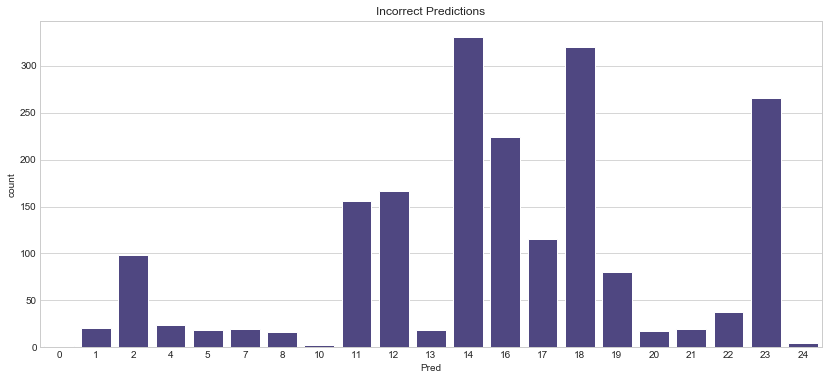

### Sing Language Recognition 

This **Notebook** aims at introducing ImageDataGenerator, and show how it can be used to train a model to recongise sign language in a set of images. You will need to download the dataset from Kaggle https://www.kaggle.com/datamunge/sign-language-mnist and save it in your local drive. The use of `ImageDataGenerator` enable us to do data augmentation which is an essential task in many machine learnign algorithms. For more details see keras docs https://keras.io/preprocessing/image/. 


```python
import os
import zipfile
from os import getcwd
from random import randint
import tensorflow as tf
from keras.preprocessing.image import ImageDataGenerator
import pandas as pd
import numpy as np
```

### Loading Data from File 
* Function to load files from local drive
* You need to have the data stored locally on your machine 


```python

#### Read files from local folder 
def get_data(filename):
    with open(filename) as training_file:
        images = []
        labels = []
        training_file.readline()
        for count,row in enumerate(training_file):
            row = row.split(',')
            label = np.array(row[0]).astype(np.float)
            string_vals = np.array(row[1:785]).astype(np.float)
            image = np.array_split(string_vals, 28)
            
            label = np.array(label) 
            image = np.array(image) 
            
            labels = np.append(labels, label)
            images.append(image)
                
                
        labels = np.array(labels).astype(int)
        images = np.array(images).astype(float)
      
    return images, labels
# path where files are located 
training_images, training_labels = get_data('../data/sign-language-mnist/sign_mnist_train.csv')
testing_images, testing_labels = get_data('../data/sign-language-mnist/sign_mnist_test.csv')

# Check dimensions
print(training_images.shape)
print(training_labels.shape)
print(testing_images.shape)
print(testing_labels.shape)
```

    (27455, 28, 28)
    (27455,)
    (7172, 28, 28)
    (7172,)


#### Explore the Data
* Show some random images 
* Run the cell again to see different set of samples 


```python
%matplotlib inline
import matplotlib.pyplot as plt

plt.figure(figsize=(10,10))
for i in range(25):
    plt.subplot(5,5,i+1)
    plt.xticks([])
    plt.yticks([])
    plt.grid(False)
    x = randint(0,training_images.shape[0])
    plt.imshow(training_images[x], cmap=plt.cm.binary)
    plt.xlabel(training_labels[x])
plt.show()
```





```python
# show some test images 
plt.figure(figsize=(10,10))
for i in range(25):
    plt.subplot(5,5,i+1)
    plt.xticks([])
    plt.yticks([])
    plt.grid(False)
    x = randint(0,training_images.shape[0])
    plt.imshow(training_images[x], cmap=plt.cm.binary)
    plt.xlabel(training_labels[x])
plt.show()
```





* Class distribution 


```python
import seaborn as sns 
plt.figure(figsize = (14,6))
# colors royalblue
              
sns.set_style("whitegrid")
g = sns.countplot(x=training_labels,color='darkslateblue')
g.set(xlabel='Class Label', ylabel='Count')
sns.despine(left=True)


```





```python
# testing labels 
plt.figure(figsize = (14,6))
sns.set_style("whitegrid")
g = sns.countplot(x=testing_labels,color='darkslateblue')
g.set(xlabel='Class Label', ylabel='Count')
sns.despine(bottom = True, left = True)
plt.show()

```





* Expand data dimension


```python
# add one more dimension (keras requirement)
training_images = np.expand_dims(training_images,axis=3)
testing_images = np.expand_dims(testing_images,axis=3)

```

### Image Data Generator (Keras)
* Define `ImageDataGenerator` for training and testing images 
* Enable Data Augmentation 
* More on Data Generator on # https://keras.io/preprocessing/image/


```python

train_datagen = ImageDataGenerator(
      rescale = 1./255.,
      rotation_range=5,
      width_shift_range=0.13,
      height_shift_range=0.3,
      fill_mode='nearest')
    

validation_datagen = ImageDataGenerator(
    rescale = 1./255)

# check output 
print(training_images.shape)
print(testing_images.shape)
```

    (27455, 28, 28, 1)
    (7172, 28, 28, 1)


* Build your Model
* Here only two conv layers and two max pooling layers 
* You can add more conv and pooling layers 


```python
# model 
model = tf.keras.models.Sequential([
    # Note the input shape is the desired size of the image 150x150 with 3 bytes color
    # This is the first convolution
    tf.keras.layers.Conv2D(64, (3,3), activation='relu', input_shape=(28, 28, 1)),
    tf.keras.layers.MaxPooling2D(2, 2),
    # The second convolution
    tf.keras.layers.Conv2D(64, (3,3), activation='relu'),
    tf.keras.layers.MaxPooling2D(2,2),
    tf.keras.layers.Dropout(0.2),
    # Flatten the results to feed into a DNN
    tf.keras.layers.Flatten(),
    tf.keras.layers.Dropout(0.2),
    # 512 neuron hidden layer
    tf.keras.layers.Dense(512, activation='relu'),

    # number of clase
    tf.keras.layers.Dense(25, activation='softmax')
])
```

* Define your optimisation function, 
* Check Keras docs for more options 
* Pay attention to learning rate 


```python
sgd = tf.keras.optimizers.SGD(lr=0.2, decay=1e-6, momentum=0.9, nesterov=True)
#adagrad= tf.keras.optimizers.Adagrad(learning_rate=0.01)
```

* Callback class for early stopping to stop training if a desired accuracy is reached 


```python
# stop training if acc reaches 96 accuracy 
class early_stop(tf.keras.callbacks.Callback):
    def on_epoch_end(self, epoch, logs={}):
        if(logs.get('accuracy')>0.99):
            print("\nReached 99.0% accuracy: Stopping training!")
            self.model.stop_training = True

# instantiated callbacks 
callbacks = early_stop() 
```

* Compile, train, run 
* and evaluate your model


```python

# Compile Model. 
model.compile(loss='sparse_categorical_crossentropy', optimizer='sgd', metrics=['accuracy'])

# number of images = batch_size * steps
batch_s = 2 # this value based on experimenting with different batch sizes 
steps_per_ep = np.ceil(training_images.shape[0]/batch_s)
steps_per_ep1 = np.ceil(testing_images.shape[0]/batch_s)
n_epochs = 30

# Train the Model
train_generator = train_datagen.flow(
        training_images,  # This is the source for training images
        training_labels,
        batch_size=batch_s)

validation_generator = validation_datagen.flow(
    testing_images,
    testing_labels,
    batch_size = batch_s)

history = model.fit(
    train_generator,
      steps_per_epoch=steps_per_ep,  #
      epochs=n_epochs,
      validation_data=validation_generator,
      validation_steps=steps_per_ep1,
      shuffle=True,  
     callbacks=[callbacks],
      verbose=1)

model.evaluate(testing_images, testing_labels, verbose=0)
```

    WARNING:tensorflow:sample_weight modes were coerced from
      ...
        to  
      ['...']
    WARNING:tensorflow:sample_weight modes were coerced from
      ...
        to  
      ['...']
    Train for 13728.0 steps, validate for 3586.0 steps
    Epoch 1/30
    13728/13728 [==============================] - 63s 5ms/step - loss: 2.6127 - accuracy: 0.2125 - val_loss: 1.2870 - val_accuracy: 0.5959
    Epoch 2/30
    13728/13728 [==============================] - 65s 5ms/step - loss: 1.2491 - accuracy: 0.5906 - val_loss: 0.4880 - val_accuracy: 0.8412
    Epoch 3/30
    13728/13728 [==============================] - 67s 5ms/step - loss: 0.7451 - accuracy: 0.7552 - val_loss: 0.3456 - val_accuracy: 0.8709
    Epoch 4/30
    13728/13728 [==============================] - 64s 5ms/step - loss: 0.5326 - accuracy: 0.8232 - val_loss: 0.1569 - val_accuracy: 0.9497
    Epoch 5/30
    13728/13728 [==============================] - 64s 5ms/step - loss: 0.4051 - accuracy: 0.8664 - val_loss: 0.0979 - val_accuracy: 0.9670
    Epoch 6/30
    13728/13728 [==============================] - 63s 5ms/step - loss: 0.3365 - accuracy: 0.8905 - val_loss: 0.0839 - val_accuracy: 0.9728
    Epoch 7/30
    13728/13728 [==============================] - 64s 5ms/step - loss: 0.2814 - accuracy: 0.9073 - val_loss: 0.0780 - val_accuracy: 0.9746
    Epoch 8/30
    13728/13728 [==============================] - 65s 5ms/step - loss: 0.2456 - accuracy: 0.9191 - val_loss: 0.0565 - val_accuracy: 0.9835
    Epoch 9/30
    13728/13728 [==============================] - 66s 5ms/step - loss: 0.2167 - accuracy: 0.9294 - val_loss: 0.0856 - val_accuracy: 0.9628
    Epoch 10/30
    13728/13728 [==============================] - 67s 5ms/step - loss: 0.1989 - accuracy: 0.9358 - val_loss: 0.1047 - val_accuracy: 0.9644
    Epoch 11/30
    13728/13728 [==============================] - 64s 5ms/step - loss: 0.1890 - accuracy: 0.9366 - val_loss: 0.0489 - val_accuracy: 0.9822
    Epoch 12/30
    13728/13728 [==============================] - 66s 5ms/step - loss: 0.1671 - accuracy: 0.9459 - val_loss: 0.0395 - val_accuracy: 0.9907
    Epoch 13/30
    13728/13728 [==============================] - 63s 5ms/step - loss: 0.1504 - accuracy: 0.9512 - val_loss: 0.0396 - val_accuracy: 0.9872
    Epoch 14/30
    13728/13728 [==============================] - 62s 4ms/step - loss: 0.1494 - accuracy: 0.9517 - val_loss: 0.0259 - val_accuracy: 0.9919
    Epoch 15/30
    13728/13728 [==============================] - 64s 5ms/step - loss: 0.1327 - accuracy: 0.9574 - val_loss: 0.0523 - val_accuracy: 0.9877
    Epoch 16/30
    13728/13728 [==============================] - 64s 5ms/step - loss: 0.1365 - accuracy: 0.9581 - val_loss: 0.0258 - val_accuracy: 0.9919
    Epoch 17/30
    13728/13728 [==============================] - 64s 5ms/step - loss: 0.1228 - accuracy: 0.9609 - val_loss: 0.0282 - val_accuracy: 0.9905
    Epoch 18/30
    13728/13728 [==============================] - 64s 5ms/step - loss: 0.1262 - accuracy: 0.9595 - val_loss: 0.0260 - val_accuracy: 0.9922
    Epoch 19/30
    13728/13728 [==============================] - 63s 5ms/step - loss: 0.1140 - accuracy: 0.9630 - val_loss: 0.0225 - val_accuracy: 0.9951
    Epoch 20/30
    13728/13728 [==============================] - 64s 5ms/step - loss: 0.1090 - accuracy: 0.9654 - val_loss: 0.0079 - val_accuracy: 0.9978
    Epoch 21/30
    13728/13728 [==============================] - 66s 5ms/step - loss: 0.0997 - accuracy: 0.9676 - val_loss: 0.0047 - val_accuracy: 0.9994
    Epoch 22/30
    13728/13728 [==============================] - 66s 5ms/step - loss: 0.1062 - accuracy: 0.9663 - val_loss: 0.0386 - val_accuracy: 0.9894
    Epoch 23/30
    13728/13728 [==============================] - 65s 5ms/step - loss: 0.0944 - accuracy: 0.9699 - val_loss: 0.0197 - val_accuracy: 0.9943
    Epoch 24/30
    13728/13728 [==============================] - 67s 5ms/step - loss: 0.0994 - accuracy: 0.9695 - val_loss: 0.0105 - val_accuracy: 0.9957
    Epoch 25/30
    13728/13728 [==============================] - 65s 5ms/step - loss: 0.0949 - accuracy: 0.9711 - val_loss: 0.0288 - val_accuracy: 0.9937
    Epoch 26/30
    13728/13728 [==============================] - 65s 5ms/step - loss: 0.0890 - accuracy: 0.9720 - val_loss: 0.0163 - val_accuracy: 0.9934
    Epoch 27/30
    13728/13728 [==============================] - 65s 5ms/step - loss: 0.0787 - accuracy: 0.9753 - val_loss: 0.0158 - val_accuracy: 0.9922
    Epoch 28/30
    13728/13728 [==============================] - 64s 5ms/step - loss: 0.0778 - accuracy: 0.9753 - val_loss: 0.0476 - val_accuracy: 0.9837
    Epoch 29/30
    13728/13728 [==============================] - 65s 5ms/step - loss: 0.0921 - accuracy: 0.9722 - val_loss: 0.0101 - val_accuracy: 0.9964
    Epoch 30/30
    13728/13728 [==============================] - 66s 5ms/step - loss: 0.0730 - accuracy: 0.9774 - val_loss: 0.0451 - val_accuracy: 0.9919


    [241.24986974287486, 0.72727275]


* Evaluate your model by extracting metrics, store them in a pandas dataframe and reshape it for visualising results


```python
acc      = history.history[ 'accuracy' ]
val_acc  = history.history[ 'val_accuracy' ]
loss     = history.history[ 'loss' ]
val_loss = history.history['val_loss' ]

epochs   = range(len(acc)) # Get number of epochs

# pandas 
zippedList =  list(zip(epochs,acc,val_acc,loss,val_loss))
results = pd.DataFrame(zippedList,columns=['Epochs','Train Accuracy','Validation Accuracy',
                                           'Train Loss','Validation Loss'])
# Reshape results 
resultsR = pd.melt(results, id_vars=['Epochs'], value_vars=['Train Accuracy','Validation Accuracy',
                                           'Train Loss','Validation Loss'])
n = len(acc) *2
resultsR.columns=['Epochs','Metric','Results']
resultsR['Performance']='Accuracy'
resultsR.loc[n:,'Performance'] = 'Loss'
resultsR.head(5)

```


<div>
<style scoped>
    .dataframe tbody tr th:only-of-type {
        vertical-align: middle;
    }

    .dataframe tbody tr th {
        vertical-align: top;
    }

    .dataframe thead th {
        text-align: right;
    }
</style>
<table border="1" class="dataframe">
  <thead>
    <tr style="text-align: right;">
      <th></th>
      <th>Epochs</th>
      <th>Metric</th>
      <th>Results</th>
      <th>Performance</th>
    </tr>
  </thead>
  <tbody>
    <tr>
      <td>0</td>
      <td>0</td>
      <td>Train Accuracy</td>
      <td>0.212457</td>
      <td>Accuracy</td>
    </tr>
    <tr>
      <td>1</td>
      <td>1</td>
      <td>Train Accuracy</td>
      <td>0.590639</td>
      <td>Accuracy</td>
    </tr>
    <tr>
      <td>2</td>
      <td>2</td>
      <td>Train Accuracy</td>
      <td>0.755199</td>
      <td>Accuracy</td>
    </tr>
    <tr>
      <td>3</td>
      <td>3</td>
      <td>Train Accuracy</td>
      <td>0.823165</td>
      <td>Accuracy</td>
    </tr>
    <tr>
      <td>4</td>
      <td>4</td>
      <td>Train Accuracy</td>
      <td>0.866400</td>
      <td>Accuracy</td>
    </tr>
  </tbody>
</table>
</div>


```python
import matplotlib.pyplot as plt
import seaborn as sns
# style
plt.style.use('seaborn-whitegrid')
 
# create a color palette
palette = plt.get_cmap('Set1')
 
g = sns.FacetGrid(resultsR, col="Performance", hue="Metric",col_wrap=2, height=6)
g = g.map(plt.plot, "Epochs", "Results", marker=".").add_legend().set_titles("{col_name}")
g
```


    <seaborn.axisgrid.FacetGrid at 0x147ecec10>





#### Show results (analyse)

* Good practice to look at the results and manually inspect incorrectly classified images/ instances 
* This can be achieved by store predictions against actual values in a data frame and 
* Visualise most correctly / incorrectly classified instances 


```python
predictions = model.predict_classes(testing_images)
results = {'Pred': predictions,'Actual':testing_labels}
df =pd.DataFrame(results)
df.head()
```


<div>
<style scoped>
    .dataframe tbody tr th:only-of-type {
        vertical-align: middle;
    }

    .dataframe tbody tr th {
        vertical-align: top;
    }

    .dataframe thead th {
        text-align: right;
    }
</style>
<table border="1" class="dataframe">
  <thead>
    <tr style="text-align: right;">
      <th></th>
      <th>Pred</th>
      <th>Actual</th>
    </tr>
  </thead>
  <tbody>
    <tr>
      <td>0</td>
      <td>14</td>
      <td>6</td>
    </tr>
    <tr>
      <td>1</td>
      <td>5</td>
      <td>5</td>
    </tr>
    <tr>
      <td>2</td>
      <td>10</td>
      <td>10</td>
    </tr>
    <tr>
      <td>3</td>
      <td>0</td>
      <td>0</td>
    </tr>
    <tr>
      <td>4</td>
      <td>11</td>
      <td>3</td>
    </tr>
  </tbody>
</table>
</div>


```python
 df[(df.Pred==df.Actual)].shape[0]
```


    5216


```python
x = df[df.Pred==df.Actual].copy()
x.shape
```


    (5216, 2)


```python
# correct predictions 
plt.figure(figsize = (14,6))
plt.suptitle('Correct Predictions')

sns.countplot(x=x.Pred,color='darkslateblue')

```


    <matplotlib.axes._subplots.AxesSubplot at 0x1047aef90>





* Notice that the instances belonging to class 3 are the least correctly classified isntnaces in our model. Worth having a look at the shape of these images (See code above to visualise some instances)


```python
xx = df[df.Pred!=df.Actual].copy()
# correct preds 
plt.figure(figsize = (14,6))
plt.title('Incorrect Predictions')
sns.countplot(x=xx.Pred,color='darkslateblue')
xx.shape
```


    (1956, 2)





* `Accuracy` on the validatoin set


```python
print ('Accuracy on validation set = ',np.round(np.mean(predictions==testing_labels),4)*100,'%')
```

    Accuracy on validation set =  72.72999999999999 %


```python

```
